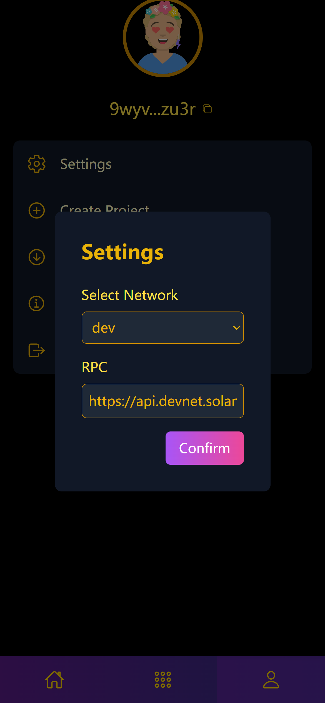
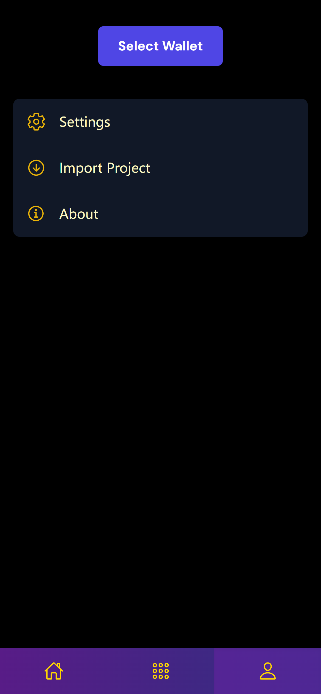
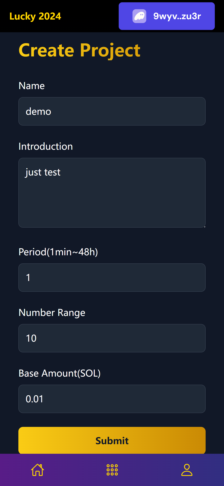
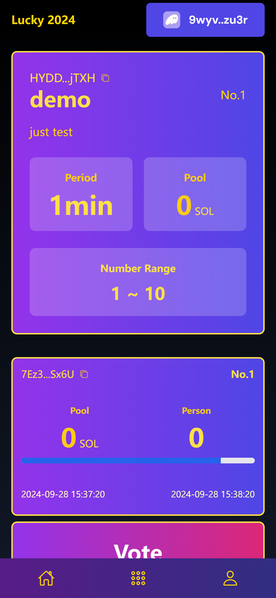
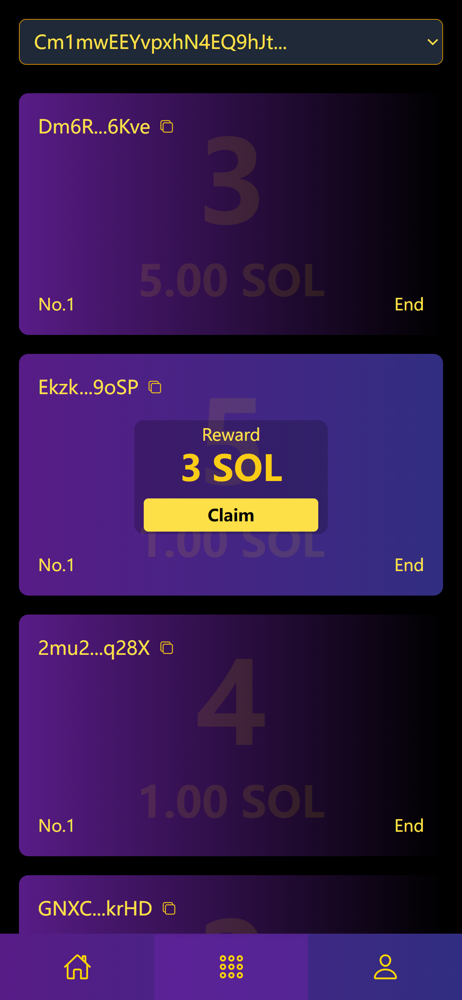

# lucky-2024

这是一个提案投票项目，有多个项目，每个项目有多期提案。

## demo

| network | project | period | number range | base amount |
| -- | -- | -- | -- | -- |
| devnet | `Cm1mwEEYvpxhN4EQ9hJtjxSRj793LdbEtG9sddL1Gw6k` | 5min | 1~5 | 0.01 SOL |
| devnet | `4MsqZqhujSdFyjFnvSf8zaFZ8tPGxskisMmaN36Ka15v` | 12h | 1~10 | 0.01 SOL |

- [faucet.solana.com](https://faucet.solana.com/), `5SOL/h`
- [solfaucet.com](https://solfaucet.com/)

    
设置网络，确保 rpc 节点能正常访问

    

    
连接钱包

    

    
导入项目或创建项目

    

    
进入项目详情进行投票

    

    
查看投票记录及领取奖励

    

